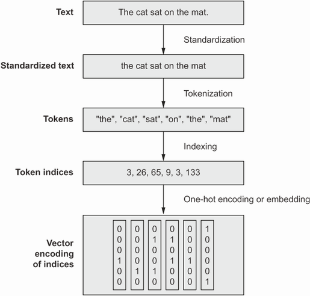

# Good evening again!

So lets start with:
1. Any questions, concerns or thoughts from our last lecture? 
2. So one from me, what did we talk about last time? 
3. And, what actually is a neural network?

Some quick terms to repeat:
1. Layer
2. Weight
3. Activation function
4. Loss
5. Batch
6. Epoch

# Let's talk about language 

Let us look at these examples:  
1. Not to brag, but I’m fluent in 10 languages. English and Binary.
2. Mary asked John to leave. Mary asked to leave John.
3. I made a great deal, killed two birds with one stone.

What types of problems do we solve:  
1. Where in the text can i find an answer to that question?
2. What is this text about?
3. How can i summarize this text?
4. Is that text appropriate?

And more broadly:  
1. How can i answer this question?
2. What is the meaning of that sentence?
3. Was that funny? 
4. How does that relate to the world?

# How do we deal with words

  

  

Let us make a representation:  

I love dogs and dogs love snacks.  
[1 2 3 4 3 2 5]  
Lets remember that networks (and any model to be fair) work on representations. We create representations to be as efficient as possible it means - take the least space and leave the most meaning.

