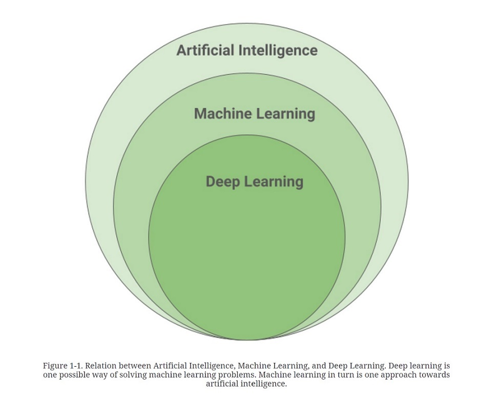
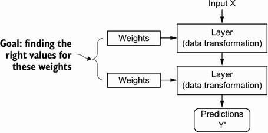
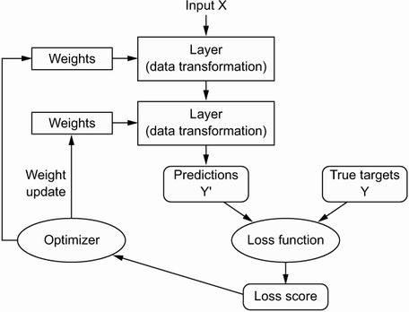

# Good evening

Hi all, my name is Pamela Krzypkowska and I will be teaching you about Deep Learning this semester. 
Some information about me:
1. I work in the Ministry of Digital Affairs
2. I 💌 Zelda and knitting
3. I graduated Computer Science @ WUT and Philisophy @ UW

# What do you know about DL? 

Have you worked with Deep Learning Methods?  
What ML Methods are you familiar with? 

# DL Intro

How it started:

  
Source: https://www.manning.com/books/deep-learning-with-python

How it's going:

Source: https://learning.oreilly.com/library/view/efficient-deep-learning/9781098117405/  

In the field of machine learning, deep learning, that is, learning with the help of multi-layer networks
of neurons is the fastest growing, and by many also considered the most important, method of all
other machine learning techniques.

So let's start with how the building blocks work:  

  

Multi layared perceptron:  

  

Backpropagation: https://towardsdatascience.com/understanding-backpropagation-algorithm-7bb3aa2f95fd  
Visual Intro to Neural Nets: https://www.youtube.com/watch?v=aircAruvnKk&list=PLZHQObOWTQDNU6R1_67000Dx_ZCJB-3pi

Loss functions: https://www.theaidream.com/post/loss-functions-in-neural-networks  
Activation functions: https://www.mygreatlearning.com/blog/activation-functions/  

  

Looking under(ish) the hood:   

  
Source: https://www.manning.com/books/deep-learning-with-python 

Deep Learning in a few diagrams:

  

Which is:  

  

Which then is:  

  
Source: https://www.manning.com/books/deep-learning-with-python  

And what about the brain?

Source: https://en.wikipedia.org/wiki/Neuron  

# Environment Set-up

# First steps

