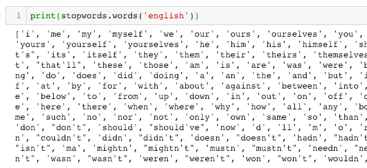
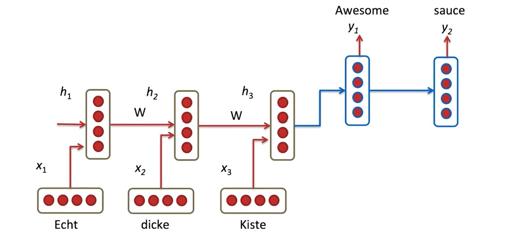
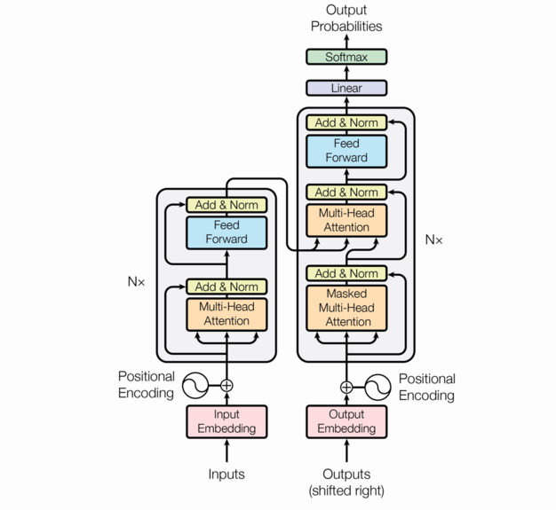

# Good evening again!

So lets start with:
1. Any questions, concerns or thoughts from our last lecture? 
2. So one from me, what did we talk about last time? 
3. And, what actually is a neural network?

Some quick terms to repeat:
1. Layer
2. Weight
3. Activation function
4. Loss
5. Batch
6. Epoch

# General rules

We need to find the sweet spot in training.

  

When training behaves unexpectedly, the issue is almost always related to the configuration of the gradient descent process.

This typically involves:

- The choice of optimizer  
- The initialization of model weights  
- The learning rate  
- The batch size  

These parameters are interdependent. Changing one often affects the behavior of the others.

In practice, it is usually sufficient to tune the learning rate and the batch size while keeping the remaining parameters constant. Systematic adjustment is more effective than changing multiple variables at once. Remember experimentation - one parameter change per one test.

- Modify the learning rate.  
  A learning rate that is too high can cause updates to overshoot.  
  A learning rate that is too low can make training appear stagnant.

- Increase the batch size.  
  Larger batches produce gradients with lower variance and more stable updates.

# Let's talk about language 

Let us look at these examples:  
1. Not to brag, but I’m fluent in 10 languages. English and Binary.
2. Mary asked John to leave. Mary asked to leave John.
3. I made a great deal, killed two birds with one stone.

What types of problems do we solve:  
1. Where in the text can i find an answer to that question?
2. What is this text about?
3. How can i summarize this text?
4. Is that text appropriate?
5. How do I say that in french?

And more broadly:  
1. How can i answer this question?
2. What is the meaning of that sentence?
3. Was that funny? 
4. How does that relate to the world?

# How do we deal with words

  
Source: https://www.manning.com/books/deep-learning-with-python 

  

Let us make a representation:  

I love dogs and dogs love snacks.  
[1 2 3 4 3 2 5]  
Lets remember that networks (and any model to be fair) work on representations. We create representations to be as efficient as possible it means - take the least space and leave the most meaning.

# BERT

What is a model? It's a problem representation. In this case - a language representation.  

LSTMs are:
1. Slow to train
2. Rather unidirectional
3. No deep context perspective
4. No task separation

Well, the actual transformer:  

BERT:
1. aim to predict the relationships between sentences by analyzing them holistically, as well as token-level tasks such as named entity recognition and question answering.
2. is designed to pretrain deep bidirectional representations from unlabeled text by jointly conditioning on both
left and right context in all layers. 
3. can create state-of-the-art models for a wide range of tasks, such as question answering,
language inference and translation.

Source: https://aclanthology.org/N19-1423.pdf [BERT: Pre-training of Deep Bidirectional Transformers for
Language Understanding]  

Source: https://aclanthology.org/N19-1423.pdf [BERT: Pre-training of Deep Bidirectional Transformers for
Language Understanding]  

On SQuAD: https://rajpurkar.github.io/SQuAD-explorer/?msclkid=2b188d20c6c111ec90a8707c579811f9  

Fun-facts:
1. BERT_BASE contains 110M parameters and BERT_LARGE contains 340M parameters
2. BERT is a 2018 child of Google Researchers
3. Pretraining is a KEY element of BERT - we are separating understanding language from a given task

If you want to dig deeper and see how to use BERT, I am redirecting yoi here: https://github.com/jalammar/jalammar.github.io/blob/master/notebooks/bert/A_Visual_Notebook_to_Using_BERT_for_the_First_Time.ipynb?msclkid=f0d906e3c6c511ec810feae29c10290c

Easy and less-easy (for eager heads) explanation of BERT: https://www.youtube.com/watch?v=xI0HHN5XKDo  
More techy with a notebook: https://www.youtube.com/watch?v=TLPmlVeEf1k  
VERY good Stanford Lecture on NLP and pretrained models: https://www.youtube.com/watch?v=knTc-NQSjKA

