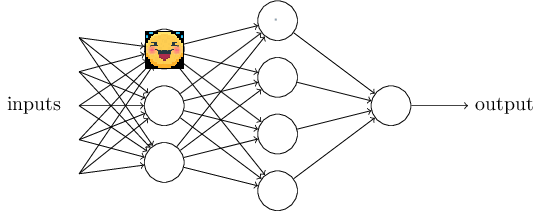

# DeepLearning-ALK

Repository with materials for 2026/27 Deep Learning courses at Koźmiński University.

## Classes

Classes are condected onsite at Koźmiński. All classes are mandatory, one absence is allowed. As always yet, **the class is for you, not for me**. If you signed up I hope you're interested in the content.

Class dates and contents are as follows: 

| Date         | Time          | Subject                       | Materials                                    |
|--------------|---------------|-------------------------------|----------------------------------------------|
| 05.10 (Mon) | 17:00 - 20:00 |  Neural Networks Introduction | [Class 1](Classes/Class-1/Class-1.md)  |
| 19.10 (Mon) | 17:00 - 21:00 |  BERT and GPT-3 - DL in NLP   | [Class 2](Classes/Class-2/Class-2.md)  |
| 26.10 (Mon) | 17:00 - 21:00 |  Convolution - DL in VIsion   | [Class 3](Classes/Class-3/Class-3.md)  |
| 09.11 (Mon) | 17:00 - 20:00 |  DL in Cloud, GPU             | [Class 4](Classes/Class-4/Class-4.md)  |
| 16.11 (Mon) 17:00 - 20:00 |  Generative AI and new developments |  |
| 23.11 (Mon) 17:00 - 20:00 |  VLLMs - DL in Vision |  |
| 07.12 (Mon) 17:00 - 20:00 |  Project result presentations | [Class 5](Classes/Class-5/Class-5.md)  |
 
Last 30min. of every class will be time for project questions, quandries and consultations. 

Materials used during classes will be shared in this repository in the coresponding folders. 
Anyone wanting to deep dive into the topic, basic literature is: https://deeplearningwithpython.io/
For more, please ask me, I will do my best to tailor your readings. 

The environment set up for what we are starting with is explained here: https://www.tutorialspoint.com/keras/keras_installation.htm. We'll be using python virtual environments and will have some time for set up and questions during our first class.

## Grading 

All the information about course grading and the project for course completion is [here](Grading.md). 

## Code of Conduct 

We are here to learn and please:
- Don't be afraid to ask questions❔
- Tell me if I'm telling things that are too obvious or too complicated
- Tell me if you have any recommendations for how the class is conducted
- Be empathetic ❤️
- Listen to others
- Be on time ⌛

